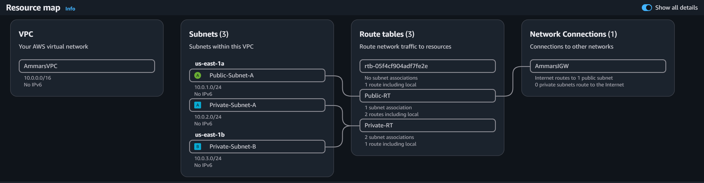
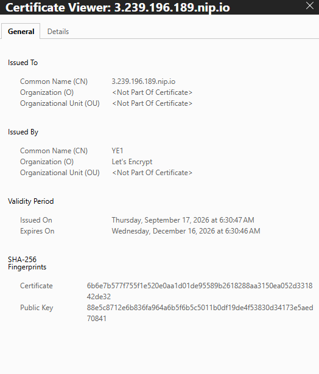
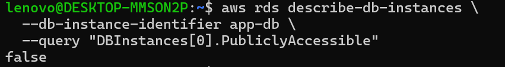
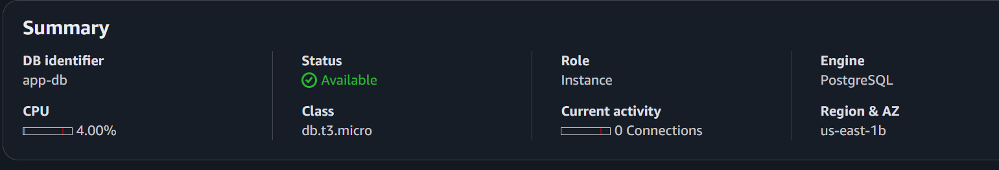
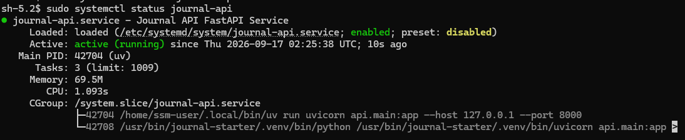

# Journal API — AWS Deployment

A two-tier AWS deployment of the Journal API (FastAPI + PostgreSQL), with a public HTTPS-facing application tier and a fully private database tier.

## Architecture

```
Internet
   │  HTTPS (443)
   ▼
Internet Gateway
   │
   ▼
VPC (10.0.0.0/16)
├── Public subnet  (10.0.1.0/24, AZ us-east-1a) — EC2: nginx + Uvicorn + FastAPI
├── Private subnet (10.0.2.0/24, AZ us-east-1a) — DB subnet group (idle slot)
└── Private subnet (10.0.3.0/24, AZ us-east-1b) — RDS PostgreSQL (app-db)
```

EC2 sits in the public subnet and is the only thing reachable from the internet, over HTTPS. RDS sits in the private subnets — AWS requires a DB subnet group to span at least two Availability Zones, so one private subnet is active and the other is just there to satisfy that requirement. The database is never publicly accessible and only accepts connections from the app tier's security group.



## What we built

**Networking:** A VPC with one public and two private subnets across two AZs, an Internet Gateway attached to the public route table only, and private route tables with no route out to the internet — no NAT Gateway needed since the database doesn't require outbound access.

**Compute:** An EC2 instance running the FastAPI app via `uv` and Uvicorn, sitting behind nginx as a reverse proxy. nginx handles incoming traffic on 80/443 and forwards it internally to Uvicorn on `127.0.0.1:8000`.

**HTTPS:** Certbot obtained a free Let's Encrypt certificate for the instance's public address and configured nginx to serve everything over HTTPS.



**Database:** RDS PostgreSQL, deployed with public access disabled, reachable only from the EC2 security group on port 5432.




**Admin access:** No SSH port is open anywhere. All administrative access to the EC2 instance goes through AWS Systems Manager Session Manager, which is IAM-authenticated and doesn't need an inbound port at all.

**Persistence:** The app runs as a systemd service, so it stays running after the admin session ends and restarts automatically if the instance reboots. Journal data lives in RDS, independent of the EC2 instance's lifecycle.



**Credentials:** Database credentials are stored in a local `.env` file on the instance, excluded from git, and never logged.

**AI + application behavior:** All CRUD endpoints and the AI sentiment-analysis endpoint were re-tested against the live HTTPS URL and work the same as they did locally.

## Security notes

- No user authentication or data isolation is implemented — this deployment is for coursework/demo purposes only; do not store real personal or sensitive journal content.
- Credentials live only in a local `.env` file on the instance, excluded from version control.
- Database access is scoped to the application tier's security group, not any CIDR range.
- No inbound SSH/RDP; all admin access is IAM-authenticated via SSM.

## Related

- Application source: [Journal API repository](#)
